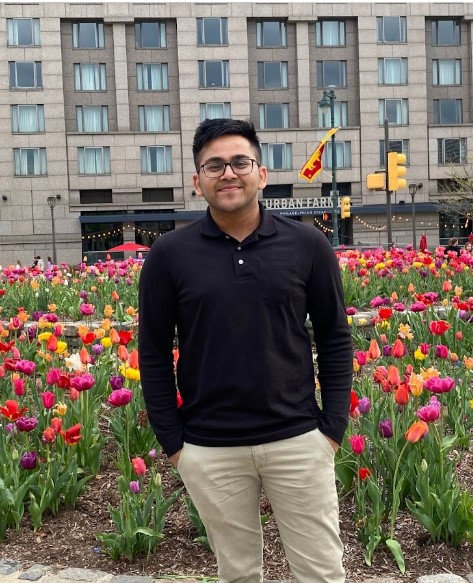

# About Us

## Tushar Mittal

Hello!
I am Tushar Mittal and I am a graduate student at Ross School of Business pursuing my Master of Business Analytics (MBAn). I am an international student from Nepal and did my undergraduate at Ramapo College of New Jersey where I double majored in Accounting and Finance. After my undergraduate, I worked at Deloitte as an Audit and Assurance Analyst in the Philadelphia office, and quickly realized that I wanted to learn more about Analytics and Data. It’s just my first semester at Ross, and I have already learnt so much! I look forward to making the best out of my time here at University of Michigan and expanding my network!

I enjoy traveling and visiting new places and believe in giving my 💯% in whatever I do. In my free time, I like to cook, play video games, or read about new and interesting topics surrounding business and tech. Feel free to connect with me on [LinkedIn](https://www.linkedin.com/in/tmittala/)!

## Maria Viera

Recently graduated from my second bachelor's degree in Economics, I am now a current Master of Business Analytics student at Ross (University of Michigan). 

I am originally from Spain with a previous background in **Dietetics** and **Sport Nutrition**. During my time in Spain and after 6 years in the **Health** field, I moved to the United States and decided to change careers to **Economics**. 

Crossing the pond for my first time in 2019 meant starting from zero: language, culture, making friends, food, career, etc. Getting involved with the community through voluntary activities while studying English, prepared me to an **English academic level in less than two years** to start my second degree in Economics. 

As a **Military Spouse**, life changes every three years, so my option to start a new career had to be online. This lifestyle tough me *to get comfortable when being uncomfortable*. As an example, the time to move for the next assignment was in the middle of my first semester, when we had to move to England (my current home). A fun fact is that I had to study on the floor for two weeks until we got some borrowed furniture. After two years and a half, I graduated this past May 2023, and a month later I started the MBAn's program which is inspiring me to keep growing and overcome my barriers to be the best version of myself. 

## Juliet Niebylski

I am Juliet Niebylski. I am a Master of Business Analytics (MBAn) student at University of Michigan, and I have a B.S.E. in Data Science from University of Michigan. I am interested to learn more about how to apply data science for business through the MBAn program. I am from Kensington, Maryland. I like to cook and bake, but I especially enjoy baking because I love desserts. I also enjoy doing different art related activities.

## Ruchi Pallod

Hi! I’m Ruchi, currently pursuing a Master of Business Analytics at Michigan Ross. I possess extensive experience in the Finance & Banking industry and have my undergraduate degree in Economics and Statistics. 
At Ross, I’m working as a Research Associate at the Economic Growth Institute. I perform financial analysis, research on automotive companies and recommend projects that these companies should undertake to remain competitive in the new EV world. 

Ross is an exciting place to be, and it’s never a dull day to be on campus! New to Michigan, I am determined to explore as many state parks as possible in these short 10 months! And I have already explored 7 state parks of the Upper Peninsula! Outside of work & classes, I enjoy reading, painting & nature walks! 

## Ashley Chen

Hello There! I’m Ashley, currently at Ross School of Business pursuing my Master of Business Analytics (MBAn). I graduated from the University of Washington, Seattle, with an Economics degree. 

After graduation, I had the incredible opportunity to work at TikTok's Data and AI Center, where I focused on business systems and databases. Subsequently, I joined Shopee's recommendation system team as a data analyst, helping them tailor their e-commerce homepage for 12 million users. These experiences have allowed me to witness how data analytics and data infrastructure can significantly empower businesses. Now I’m excited to delve deeper into the intersection of data and technology at Ross!

My hobbies include literature, singing, immersing myself in nature, and exploring cross-cultural travel experiences. Feel free to connect with me on LinkedIn!
