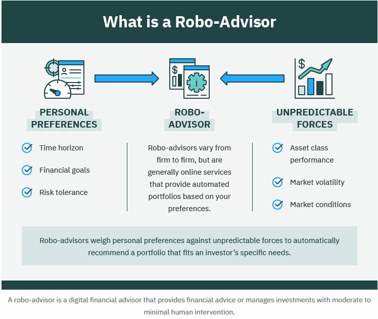
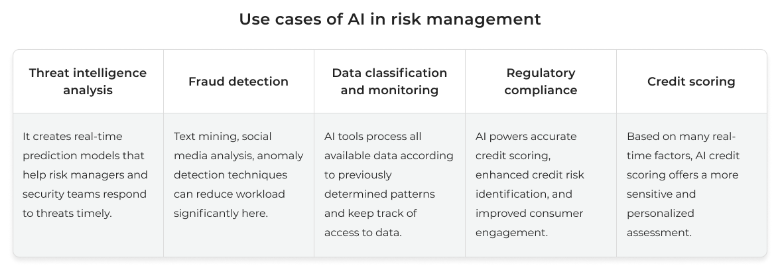
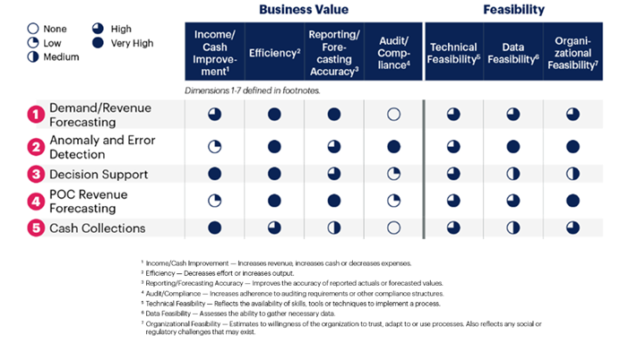

# Finance

Like any other industry, the growth of technology has also had profound impacts in the field of finance. Technologies and innovations like real-time stock price movements, online brokerage, digital currencies, mobile banking, and peer-to-peer payments are some of the few examples of how technology has influenced the financial industry and our daily lives. These technologies also gave rise to the FinTech industry - combining Finance and Technology. However finance in business is a much broader topic encompassing capital and credit markets, investments, wealth and asset management, mergers and acquisition, risk management and compliance, insurance, as well as corporate finance.

Much of the financial tasks like data entry and even stock transactions were manually driven until the late 2010s. However, automation and launch of various software tools like Microsoft Excel, Bloomberg, ERP softwares like Oracle and SAP helped take the next leap in finance. 

Moreover, AI in finance has been the topic of interest for over a decade now. “Artificial intelligence (AI) in finance helps drive insights for data analytics, performance measurement, predictions and forecasting, real-time calculations, customer servicing, intelligent data retrieval, and more” (AI in Finance, n.d.). Through its capabilities to handle large sets of data at relatively short periods of time, AI and Large language models can help automate financial processes which in turn help free up resources both human or otherwise that can be essential for faster decision making, efficient forecasting, and improved client relationships.

Let’s take a deeper look at how AI is currently affecting different aspects of finance in business:

## Banking and credit markets

AI is already helping lenders and creditors improve their product offerings such as credit cards and loans to a variety of consumers by helping companies improve credit risk assessments while targeting the right consumers and catering to their specific needs. For instance, “Atlas Credit, a small-dollar lender, used a machine learning-powered model and automation to nearly double its loan approval rates and decrease credit losses by up to 20 percent” (Lee, 2023). Through use of AI underwriters, companies like underwrite.ai and Zest AI have been able to assess and predict credit risk even for customers with little to no credit history. As a result, credit markets have exponentially expanded providing access and credit to hundreds of lenders who were previously ineligible.

## Capital Market (Investments, Personal Finance, and Wealth Management)

By taking the sentiment away and providing relevant and accurate technical information, AI, in the form of robo-advisors, can help make efficient investment strategies for both hedge funds and retail investors. “AI can assist with smart order routing, price optimization, best execution, and optimal allocations of block trades, in addition to automated algorithmic trading” (Sandoval & Riddell, 2023). These are just a few examples of how AI has the potential in portfolio optimization and capital budgeting, allowing for more sophisticated and data-driven decision-making processes in investment management. Furthermore, natural language processing is also being used by several investment management firms and banks to maintain client relationships by using conversational “virtual assistants” like Erica by Bank of America and Fargo by Wells Fargo Bank to deliver personalized information to its customers.

## Risk management and compliance

Risk management mainly refers to identifying, assessing, controlling, and/or monitoring several external and internal factors relating to financial, legal, ethical, security, and corporate strategy with the aim of reducing the occurrence and/or impact of such factors. “In risk management, AI/ML has become synonymous with improving efficiency and productivity while reducing costs. This has been possible due to the technologies’ ability to handle and analyze large volumes of unstructured data at faster speeds with considerably lower degrees of human intervention” (Basrai & Ali, 2021). Hence, use of AI has enabled financial firms in fraud detection and financial regulatory compliance especially by using predictive analysis to provide early and real time risk detections. AI and ML for regulatory compliance and intelligent quality control also enable firms to develop robust contingency and mitigation plans to possible risk scenarios as well as enable proper training for their workforce. Following are a few other use cases of AI in risk management:

## Corporate finance
	
Besides regular automation to streamline manual processes, AI is also used in the finance function in different industries for strategy building, revenue and cash forecasting, and what-if scenario analysis for faster decision making and operational efficiency. “Gartner analysts examined 23 AI use cases in corporate finance representing the types of processes a future-looking autonomous finance organization will work on. They were ranked according to their business value and feasibility of implementation” (Gartner, 2022). Of the 23 use cases, the top five, according to the business value and feasibility, that Financial Planning and Analysis (FP&A) leaders can implement now are shown below. Rather than traditional forecasting, using AI/ML models provide highly relevant and reliable information which can also be applicable in other corporate functions.

##  What might Finance look like in the next 5 years?

Financial analysts will still be a very sought-after profession in the coming future, however, the profession will evolve from mere date entry, reporting, and analysis to data interpretation and relationship management. Knowledge of financial and accounting principles will be core to the profession and will help develop algorithms that will aid finance professionals in business analysis, building strategies, and communication with stakeholders.
