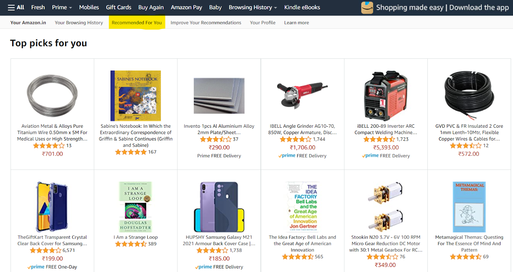
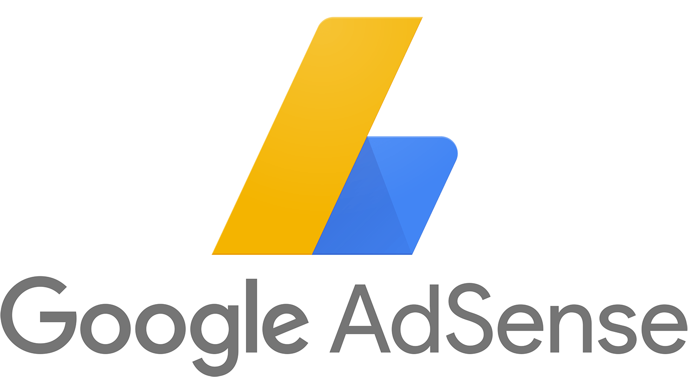

# Tech 

## Three Main Ways Tech Companies Make Money (Three Major Business Models):

1. Product Sales: Many tech companies generate revenue by selling their products or licensing their software to customers. This can include software applications, operating systems, productivity tools, and more.
Example: Amazon, Apple.

2. Subscription Services: With the rise of cloud computing, SaaS, and subscription-based models, services and subscriptions have become an increasingly important revenue source for tech companies. This could include companies offering cloud infrastructure, collaboration tools, CRM platforms, and more. Customers pay a recurring fee to access and use the software, platforms, or services, and can also include regular updates and customer support.
Example: Amazon Web Services (AWS), GCP, MS Azure, Salesforce.

3. Advertising: Tech companies that offer online platforms, social media networks, search engines, and other digital services often generate revenue through advertising and data monetization. They collect user data to target ads more effectively, and advertisers pay for placement on their platforms. These companies offer their services for free to users while generating substantial revenue from advertisers. Example: Google's search advertising, Facebook, Instagram, WhatsApp.

## How Can Tech Companies Utilize AI to Make More Money?

### Product Sales:

1. Personalized Product Recommendations: Implement AI-powered recommendation systems that analyze customer behavior and preferences to provide personalized product suggestions. This can increase cross-selling and upselling opportunities, leading to higher product sales.

2. Predictive Maintenance: If the company sells hardware products, AI can be used to predict equipment failures and maintenance needs, enhancing the value proposition and reducing post-sales support costs.

3. Dynamic Pricing: AI algorithms can optimize pricing strategies by analyzing market trends, competitor pricing, and customer demand. This can help maximize revenue by adjusting prices in real-time for optimal sales outcomes.(Palmer, A., 2023). Example: Amazon's Product Recommendations

  	
### Services and Subscriptions:

1. Enhanced Customer Support: Utilize AI-driven chatbots and virtual assistants to provide proactive and efficient customer support. This can lead to improved customer satisfaction and retention, contributing to subscription renewals.

2. Usage Analytics and Insights: AI can analyze user behavior and usage patterns within subscription services. This data can be used to refine service offerings, identify opportunities for feature expansion, and tailor services to customer needs.

3. Predictive Churn Prevention: AI can predict when subscribers are likely to cancel their services. By identifying potential churn risks early, companies can take proactive measures to retain customers and reduce subscription attrition.
Example: Amazon Web Services (AWS)

### Advertising

Targeted Advertising: AI algorithms can analyze user data to create highly targeted and relevant advertisements. This improves click-through rates and ad engagement, leading to increased ad revenue.
Example: Google's AdSense

## Major Costs for Tech Companies:

Running and maintaining tech operations require investments in operational infrastructure and ongoing operational expenses. Efficiently managing these operational expenses is essential for maintaining profitability.

1. Operational and Infrastructure Costs: This includes costs associated with data centers, cloud services, hardware maintenance, software licenses, office facilities, utilities, employee salaries, and administrative functions. 

2. Cybersecurity: Tech companies also invest in cybersecurity measures to protect sensitive data and intellectual property, which can add to operational costs. 

Example: Meta invests a lot in operating data centers, providing cloud services, and maintaining global infrastructure are critical aspects of Meta's operations. Additionally, the company invests cybersecurity measures to safeguard user data and maintain operational efficiency.

## How Can Tech Companies Utilize AI to Reduce Costs?

Google's data centers are known for their energy-efficient operations. The company uses AI-driven predictive analytics to optimize cooling systems and energy usage within its data centers. AI algorithms analyze real-time data to make dynamic adjustments, ensuring efficient cooling while minimizing energy consumption. This has led to substantial energy savings and reduced operational costs for Google's data center operations.

