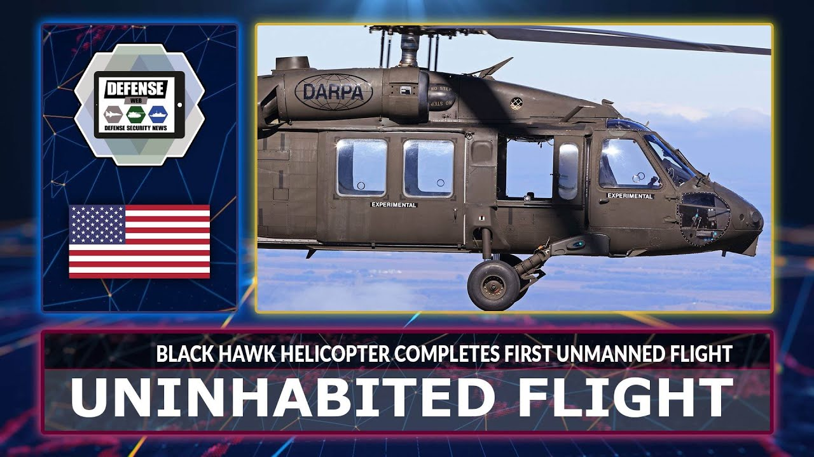

# Public Sector - Department of Defense

The swift progress of technology and the incredible proliferation of artificial intelligence worldwide have propelled society to live into a fast-paced and adaptable information age, which besides its benefits is also accompanied by an uncertain and concerning future. The Department of Defense (DOD) has noted that other enemy countries have not just learned and acquired artificial intelligence, but they have done so with less transparent usage policies (Clark, 2023; CSIS, 2020).

Marine Corps Lt. Gen. Michael S. Groen, director of the Joint Artificial Intelligence Center assures that **“The Department of Defense mission is to accelerate DOD’s technology with the vision of transforming the department with artificial intelligence.”** In order to keep ahead in modern technology, the DOD had to learn from the commercial environment to escalate the use of artificial intelligence as an inclusion of modernized processes, improving data, and platforms to adapt them across the military (CSIS, 2020). The Department of Defense goal for the use of artificial intelligence is not just for Warfield but also as training for military personnel.

## AI in Military Training
### Cerego

The Army and Air Force are embracing an innovative software system named **Cerego** utilizing machine learning and artificial intelligence to streamline class duration and enhance students’ engagement (Stilwell, n.d.). In 2019, the Joint Base San Antonio Lackland, Texas began texting Cerego’s adaptive learning programs in basic military training. The app will allow the instructor to program and load the class material into the software to instantly appear for the student accessibility (Stilwell, n.d.).

The intention of Cerego was never to replace instructors, who play a vital role in the guiding process of the students. An assessment was conducted to teach pilot soldiers in the Army’s Tactical Combat Casualty Care (TCCC) for all Combatants online course. While the personnel learning process was mostly through Cerego’s online platform, a significant portion of the curriculum required practical aspects of learning such as mastering the utilization of specialized tourniquets within their medical kits (Stilwell, n.d.).

The trial demonstrated that Cerego not only managed to condense the time of teaching the Army TCCC Course from 12 hours to fewer than 6 hours, but also supplied Combatants with ample learning practice crucial for executing mission-critical operations with life-or-death consequences (Stilwell, n.d.).

### Live Tester - Donovan

The Department of Defense has recently adopted a new AI tool that conducts live tests to elevate generative artificial intelligence in decision-making processes. Live testers can process requested secret-level and classified data in just 10 minutes, compared to human hours that it would take to be completed (Nelson, 2023).

The innovative technology such as **Donovan**, is able to simulate hypothetical war between the United States and China over Taiwan based on over 60,000 pages of American and Chinese military documents and open-source information. Even though the idea of the U.S. military working with AI may bring out images from the action film  _“Terminator”_, the director of the emerging capabilities policy at the DOD, Michael C. assures that, **"We both want to do them in a safe and responsible way, but also want to do them in a way that can push forward the cutting edge and ensure the department has access to the emerging technologies that it needs to stay ahead"** (Nelson, 2023).

## AI in Drones
### Project Maven

A new approach of the Department of Defense regarding artificial intelligence besides being more effective during military missions, is to gather data for a human analyst to review (The Guardian, 2018). Drew Cukor, chief of the DoD’s Algorithmic Warfare Cross-Function Team, explained the idea of the project as “People and computers will work symbiotically to increase the ability of weapon systems to detect objects. Eventually we hope that one analyst will be able to do twice as much work, potentially three times as much, as they’re doing now. That’s our goal.”

In order to develop this idea, the DOD wanted Google’s TensorFlow AI systems to be established in Project Maven to use machine learning and artificial intelligence to analyze footage shot by US drones (The Guardian, 2018).
 
## AI in Aviation
### Sikorsky & DARPA’s autonomous Black Hawk® Flies Logistic and Rescue Missions

As Lockheed Martin is one of largest and sophisticated military equipment providers to the US and its allies, in 2022 the company with the collaboration of the Defense Advanced Research Projects Agency (DARPA) demonstrated the capability of a new Black Hawk helicopter prepared to fly safely without pilots as well as perform cargo resupply missions, and rescue operations (Lockheed Martin, n.d.; Llano, 2022).

The autonomous Black Hawk prototype showed to the U.S. Army’s Project Convergence 2022 (PC22) how the future aviation can be used for complex military missions, giving more flexibility in limited visibility or contested environments as well as decreasing risk of being injured by attack (Lockheed Martin, n.d.; Llano, 2022).

## Future Prospects

The Department of Defense envisions a future where artificial intelligence collaborates synergistically with human intellect. The goal is not to replace military personnel, but rather to enhance their missions by enabling them to operate faster, smarter, and efficiently.
