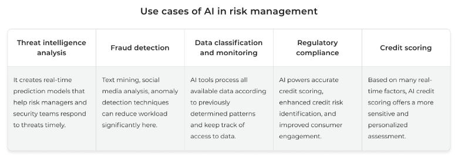

# Table Of Contents {.unnumbered}

1. [Introduction](https://tmittala.github.io/Recipe_for_Success/introduction.html)
2. [About Us](https://tmittala.github.io/Recipe_for_Success/about-us.html)
3. [Need for Hard Adoption](https://tmittala.github.io/Recipe_for_Success/need-for-hard-adoption.html)
4. [Industry Overview](https://tmittala.github.io/Recipe_for_Success/industry-overview.html)
5. [Finance](https://tmittala.github.io/Recipe_for_Success/finance.html)
6. [Tech](https://tmittala.github.io/Recipe_for_Success/tech.html)
7. [Retail](https://tmittala.github.io/Recipe_for_Success/retail.html)
8. [Automotive](https://tmittala.github.io/Recipe_for_Success/automotive.html)
9. [Public Sector - Department of Defense](https://tmittala.github.io/Recipe_for_Success/public-sector---department-of-defense.html)
10. [Things to Consider](https://tmittala.github.io/Recipe_for_Success/things-to-consider.html)
11. [Conclusion](https://tmittala.github.io/Recipe_for_Success/conclusion-1.html)

<!--chapter:end:index.Rmd-->

# Introduction {.unnumbered}

__Adoption of AI in Business__

Looking back when computers first came, the big question was if technology would dominate the world. In 2000, the whole world wondered if the internet would dominate the existing systems. And now in 2023, with the advent of AI, the big question is __How is the world going to change now?__

As AI technologies develop, companies need to adapt corporate strategies to utilize these technologies for their benefit. AI should be utilized in conjunction with humans. The evolving landscape of AI does not mean the replacement of human involvement but rather a harmonious collaboration of human intellect with machine acumen in an era of innovation and efficacy.

The integration of AI has brought forth unparalleled opportunities to solve complex problems, automate tasks, and revolutionize industries. AI’s fundamental strength lies in its ability to analyze vast dataset, learn from patterns, and generate intelligent insights has paved the way for groundbreaking advancements in diverse fields. However, optimizing the potential of AI requires a strategic approach that goes beyond a superficial understanding of the technology. 
The convergence of AI and human intellect would mean for the companies to restructure their plan of problem solving, decision making, and creative thinking. The new dynamic synergy should be integrated by companies as a natural part of it. The aim is not a substitution of tasks but to cultivate an environment where AI empowers human potential.

The purpose of this project is to guide the reader through a variety of industries illustrating their current application of artificial intelligence and the primary objectives they aim to achieve through its implementation. 

<!--chapter:end:01-Intro.Rmd-->

# About Us

## Ashley Chen

Hello There! I’m Ashley, currently at Ross School of Business pursuing my Master of Business Analytics (MBAn). I graduated from the University of Washington, Seattle, with an Economics degree. 

After graduation, I had the incredible opportunity to work at TikTok's Data and AI Center and Shopee's recommendation system team as a data analyst. These experiences have allowed me to witness how technology and data can significantly empower businesses, which I’m excited to delve deeper into at Ross! My hobbies include literature, psychology, enjoying music, exploring nature, and cross-cultural experiences. 

## Tushar Mittal

Hello!
I am Tushar Mittal and I am a graduate student at Ross School of Business pursuing my Master of Business Analytics (MBAn). I am an international student from Nepal and did my undergraduate at Ramapo College of New Jersey where I double majored in Accounting and Finance. After my undergraduate, I worked at Deloitte as an Audit and Assurance Analyst in the Philadelphia office, and quickly realized that I wanted to learn more about Analytics and Data. It’s just my first semester at Ross, and I have already learnt so much! I look forward to making the best out of my time here at University of Michigan and expanding my network!

I enjoy traveling and visiting new places and believe in giving my 💯% in whatever I do. In my free time, I like to cook, play video games, or read about new and interesting topics surrounding business and tech. Feel free to connect with me on [LinkedIn](https://www.linkedin.com/in/tmittala/)!

## Juliet  Niebylski

I am Juliet Niebylski. I am a Master of Business Analytics (MBAn) student at University of Michigan, and I have a B.S.E. in Data Science from University of Michigan. I am interested to learn more about how to apply data science for business through the MBAn program. I am from Kensington, Maryland. I like to cook and bake, but I especially enjoy baking because I love desserts. I also enjoy doing different art related activities.

## Ruchi Pallod

Hi! I’m Ruchi, currently pursuing a Master of Business Analytics at Michigan Ross. I possess extensive experience in the Finance & Banking industry and have my undergraduate degree in Economics and Statistics. 
At Ross, I’m working as a Research Associate at the Economic Growth Institute. I perform financial analysis, research on automotive companies and recommend projects that these companies should undertake to remain competitive in the new EV world. 

Ross is an exciting place to be, and it’s never a dull day to be on campus! New to Michigan, I am determined to explore as many state parks as possible in these short 10 months! And I have already explored 7 state parks of the Upper Peninsula! Outside of work & classes, I enjoy reading, painting & nature walks! 

## Maria Viera

Recently graduated from my second bachelor's degree in Economics, I am now a current Master of Business Analytics student at Ross (University of Michigan). 

I am originally from Spain with a previous background in **Dietetics** and **Sport Nutrition**. During my time in Spain and after 6 years in the **Health** field, I moved to the United States and decided to change careers to **Economics**. 

Crossing the pond for my first time in 2019 meant starting from zero: language, culture, making friends, food, career, etc. Getting involved with the community through voluntary activities while studying English, prepared me to an **English academic level in less than two years** to start my second degree in Economics. 

As a **Military Spouse**, life changes every three years, so my option to start a new career had to be online. This lifestyle tough me *to get comfortable when being uncomfortable*. As an example, the time to move for the next assignment was in the middle of my first semester, when we had to move to England (my current home). A fun fact is that I had to study on the floor for two weeks until we got some borrowed furniture. After two years and a half, I graduated this past May 2023, and a month later I started the MBAn's program which is inspiring me to keep growing and overcome my barriers to be the best version of myself. 

<!--chapter:end:02-About-Us.Rmd-->

# Need for Hard Adoption

In today's landscape, AI has obviously taken the spotlight, captivating businesses worldwide as they seek to unlock its potential for maximum value. Yet, a fundamental question emerges: how can organizations effectively integrate AI into their business? There has been an uptick in technology adoption, no doubt, for instance while radio adoption spanned 47 years, the internet achieved over 80% adoption in just 23 years in the US. However, the context shifts when we consider AI. It calls for resolute hard adoption, not through gradual refinement such as in IT which took almost over a decade to transform businesses, but through swift, transformative shifts to reshape both business processes and mindsets.

## Relevance of Hard Adoption: {-}
Companies that have technology at their core will emerge as clear winners. "There's a clear differentiation being set between automotive companies not by AI but by their corporate culture. And it's a very old dilemma that exists between technology and businesses, because technology can achieve many things but when the business itself resists disruption, technology alone cannot do much," says Pedro Pacheco, VP Analyst at Gartner who believes that for the new breed of vehicle manufacturers like Tesla, software comes first. "Because of that, it's a lot easier for them to redefine business models where they can extract the biggest business benefit from software. And these are the companies that most likely will be in a better position to extract benefits from AI," he explains.

Many AI investments tend to focus on developing or acquiring isolated capabilities for specific use cases. This approach overlooks the importance of integrating AI capabilities cohesively to solve real business challenges and cater to various use cases. Organizations that persist in ad hoc AI investment strategies run the risk of lagging behind competitors who effectively harness this evolving technology to achieve substantial productivity improvements.

Gartner suggests a 5 phase model to show how AI can be leveraged within their organization, from identification of viable use cases through to managing outputs. (Gartner, n.d.)

1. Business Case: How can we use AI to identify and scope the business problem that needs to be solved or business outcome that needs to be achieved?
2. Data Discovery: How can we use AI to determine what data is needed to address the business problem or deliver on the business outcome?
3. Model Selection: Which AI model is best suited to help us solve the targeted business problem or deliver on the targeted business outcome?
4. Model Deployment: How can we train and test our model to ensure it will produce the insights necessary to solve the business problem or deliver on the business outcome?
5. Continuous Monitoring: How can we ensure continued accuracy, precision and recall for the model we deployed so that we can provide appropriate levels of assurance and make adjustments if needed?

<!--chapter:end:03-Need-for-Hard-Adoption.Rmd-->

# Industry Overview

In this website, we will be discussing how AI is being adopted in five different industries. These industries are Finance, Tech, Retail, Automotive, and the Public Sector with examples from the Department of Defense. Through these examples, we can see that …

<!--chapter:end:04-Industry-Overview.Rmd-->

# Finance

Like any other industry, the growth of technology has also had profound impacts in the field of finance. Technologies and innovations like real-time stock price movements, online brokerage, digital currencies, mobile banking, and peer-to-peer payments are some of the few examples of how technology has influenced the financial industry and our daily lives. These technologies also gave rise to the FinTech industry - combining Finance and Technology. However finance in business is a much broader topic encompassing capital and credit markets, investments, wealth and asset management, mergers and acquisition, risk management and compliance, insurance, as well as corporate finance.

Much of the financial tasks like data entry and even stock transactions were manually driven until the late 2010s. However, automation and launch of various software tools like Microsoft Excel, Bloomberg, ERP softwares like Oracle and SAP helped take the next leap in finance. 

Moreover, AI in finance has been the topic of interest for over a decade now. “Artificial intelligence (AI) in finance helps drive insights for data analytics, performance measurement, predictions and forecasting, real-time calculations, customer servicing, intelligent data retrieval, and more” (AI in Finance, n.d.). Through its capabilities to handle large sets of data at relatively short periods of time, AI and Large language models can help automate financial processes which in turn help free up resources both human or otherwise that can be essential for faster decision making, efficient forecasting, and improved client relationships.

Let’s take a deeper look at how AI is currently affecting different aspects of finance in business:

## Banking and credit markets

AI is already helping lenders and creditors improve their product offerings such as credit cards and loans to a variety of consumers by helping companies improve credit risk assessments while targeting the right consumers and catering to their specific needs. For instance, “Atlas Credit, a small-dollar lender, used a machine learning-powered model and automation to nearly double its loan approval rates and decrease credit losses by up to 20 percent” (Lee, 2023). Through use of AI underwriters, companies like underwrite.ai and Zest AI have been able to assess and predict credit risk even for customers with little to no credit history. As a result, credit markets have exponentially expanded providing access and credit to hundreds of lenders who were previously ineligible.

## Capital Market (Investments, Personal Finance, and Wealth Management)

By taking the sentiment away and providing relevant and accurate technical information, AI, in the form of robo-advisors, can help make efficient investment strategies for both hedge funds and retail investors. “AI can assist with smart order routing, price optimization, best execution, and optimal allocations of block trades, in addition to automated algorithmic trading” (Sandoval & Riddell, 2023). These are just a few examples of how AI has the potential in portfolio optimization and capital budgeting, allowing for more sophisticated and data-driven decision-making processes in investment management. Furthermore, natural language processing is also being used by several investment management firms and banks to maintain client relationships by using conversational “virtual assistants” like Erica by Bank of America and Fargo by Wells Fargo Bank to deliver personalized information to its customers.

## Risk management and compliance

Risk management mainly refers to identifying, assessing, controlling, and/or monitoring several external and internal factors relating to financial, legal, ethical, security, and corporate strategy with the aim of reducing the occurrence and/or impact of such factors. “In risk management, AI/ML has become synonymous with improving efficiency and productivity while reducing costs. This has been possible due to the technologies’ ability to handle and analyze large volumes of unstructured data at faster speeds with considerably lower degrees of human intervention” (Basrai & Ali, 2021). Hence, use of AI has enabled financial firms in fraud detection and financial regulatory compliance especially by using predictive analysis to provide early and real time risk detections. AI and ML for regulatory compliance and intelligent quality control also enable firms to develop robust contingency and mitigation plans to possible risk scenarios as well as enable proper training for their workforce. Following are a few other use cases of AI in risk management:

## Corporate finance
	
Besides regular automation to streamline manual processes, AI is also used in the finance function in different industries for strategy building, revenue and cash forecasting, and what-if scenario analysis for faster decision making and operational efficiency. “Gartner analysts examined 23 AI use cases in corporate finance representing the types of processes a future-looking autonomous finance organization will work on. They were ranked according to their business value and feasibility of implementation” (Gartner, 2022). Of the 23 use cases, the top five, according to the business value and feasibility, that Financial Planning and Analysis (FP&A) leaders can implement now are shown below. Rather than traditional forecasting, using AI/ML models provide highly relevant and reliable information which can also be applicable in other corporate functions.

##  What might Finance look like in the next 5 years?

Financial analysts will still be a very sought-after profession in the coming future, however, the profession will evolve from mere date entry, reporting, and analysis to data interpretation and relationship management. Knowledge of financial and accounting principles will be core to the profession and will help develop algorithms that will aid finance professionals in business analysis, building strategies, and communication with stakeholders.

<!--chapter:end:05-Finance.Rmd-->

# Tech 

## Three Main Ways Tech Companies Make Money (Three Major Business Models):

1. Product Sales: Many tech companies generate revenue by selling their products or licensing their software to customers. This can include software applications, operating systems, productivity tools, and more.
Example: Amazon, Apple

2. Subscription Services: With the rise of cloud computing, SaaS, and subscription-based models, services and subscriptions have become an increasingly important revenue source for tech companies. This could include companies offering cloud infrastructure, collaboration tools, CRM platforms, and more. Customers pay a recurring fee to access and use the software, platforms, or services, and can also include regular updates and customer support.
Example: Amazon Web Services (AWS), GCP, MS Azure, Salesforce

3. Advertising: Tech companies that offer online platforms, social media networks, search engines, and other digital services often generate revenue through advertising and data monetization. They collect user data to target ads more effectively, and advertisers pay for placement on their platforms. These companies offer their services for free to users while generating substantial revenue from advertisers.

Example: Google's search advertising, Facebook, Instagram, WhatsApp

## How Can Tech Companies Utilize AI to Make More Money?

### Product Sales:

1. Personalized Product Recommendations: Implement AI-powered recommendation systems that analyze customer behavior and preferences to provide personalized product suggestions. This can increase cross-selling and upselling opportunities, leading to higher product sales.

2. Predictive Maintenance: If the company sells hardware products, AI can be used to predict equipment failures and maintenance needs, enhancing the value proposition and reducing post-sales support costs.

3. Dynamic Pricing: AI algorithms can optimize pricing strategies by analyzing market trends, competitor pricing, and customer demand. This can help maximize revenue by adjusting prices in real-time for optimal sales outcomes.
  	Example: Amazon's Product Recommendations
  	
### Services and Subscriptions:

1. Enhanced Customer Support: Utilize AI-driven chatbots and virtual assistants to provide proactive and efficient customer support. This can lead to improved customer satisfaction and retention, contributing to subscription renewals.

2. Usage Analytics and Insights: AI can analyze user behavior and usage patterns within subscription services. This data can be used to refine service offerings, identify opportunities for feature expansion, and tailor services to customer needs.

3. Predictive Churn Prevention: AI can predict when subscribers are likely to cancel their services. By identifying potential churn risks early, companies can take proactive measures to retain customers and reduce subscription attrition.
Example: Amazon Web Services (AWS)

### Advertising

Targeted Advertising: AI algorithms can analyze user data to create highly targeted and relevant advertisements. This improves click-through rates and ad engagement, leading to increased ad revenue.
Example: Google's AdSense

## Major Costs for Tech Companies:

Running and maintaining tech operations require investments in operational infrastructure and ongoing operational expenses. Efficiently managing these operational expenses is essential for maintaining profitability.

1. Operational and Infrastructure Costs: This includes costs associated with data centers, cloud services, hardware maintenance, software licenses, office facilities, utilities, employee salaries, and administrative functions. 

2. Cybersecurity: Tech companies also invest in cybersecurity measures to protect sensitive data and intellectual property, which can add to operational costs. 

Example: Meta invests a lot in operating data centers, providing cloud services, and maintaining global infrastructure are critical aspects of Meta's operations. Additionally, the company invests cybersecurity measures to safeguard user data and maintain operational efficiency.

## How Can Tech Companies Utilize AI to Reduce Costs?

Google's data centers are known for their energy-efficient operations. The company uses AI-driven predictive analytics to optimize cooling systems and energy usage within its data centers. AI algorithms analyze real-time data to make dynamic adjustments, ensuring efficient cooling while minimizing energy consumption. This has led to substantial energy savings and reduced operational costs for Google's data center operations.

<!--chapter:end:06-Tech.Rmd-->

# Retail

## Introduction

AI can be used in many areas of the retail industry such as providing personalized recommended products, managing inventory, and creating customer service chatbots (Sularia, 2023). According to a KPMG study, the three areas that retail companies thought AI would have the biggest impact in the retail industry are “customer intelligence …, inventory management … and chatbots for customer service” (Alva, n.d.). AI can be used for “automating a wide range of tasks and enabling the creation of entirely new products and services” in the retail industry (Sularia, 2023).

Walmart has been implementing AI in many areas of the company. Here are some examples of how Walmart is using AI:

## Retail Stores

### In-Store Robots

Walmart uses AI in its stores through the use of a robotic floor cleaner which also takes photos of the shelves inside the store (DeVon, 2023). Based on these images, a program automatically alerts the store of what product needs to be restocked (DeVon, 2023). This two-in-one robot is useful in providing customers with a better shopping experience since it both cleans the floors and alerts of a needed restock so that customers are in a cleaner store with stocked shelves.

### Store that Relies on AI

Walmart launched a store that relies on AI in 2019 which contains many cameras to check the shelf inventory and sensors that get 1.6 TB of data every second (Perez, 2019). This store is known as the Walmart Intelligent Retail Lab (Walmart’s AI-Powered Store of the Future Is Nothing Like Amazon Go, n.d.). Employees are notified of specific items that need a restock based on this data (Perez, 2019). Walmart has plans to use AI to check to make sure shopping carts are available and that there are enough open check-out lines (Perez, 2019). However, there is a concern about jobs security with the use of AI, but Walmart says that “the tech isn’t replacing jobs, but instead frees up staff to interact with customers” (Perez, 2019). This could increase staff efficiency by having an AI find specific tasks that are needed to be fulfilled rather than having staff spend time looking for what needs to be done in a store. This time can then be spent on doing those needed tasks. Based on the AI implementation at this store, “its best findings and developments will be applied and pared down across Walmart's 4,800 existing stores” (Walmart’s AI-Powered Store of the Future Is Nothing Like Amazon Go, n.d.). This shows that Walmart is testing out how AI can be useful in store. By utilizing a test store, they don’t have to spend additional resources on widespread adoption of potential features of AI that they later find to not be needed.

## Online

### Substitutable Product Algorithm

Walmart uses AI to determine a substitute item for a customer’s online grocery order (Owen, 2021). This recommended substitute is sent to a customer where it is approved or denied (Owen, 2021). The data of this decision is reported and is used to help train the AI (Owen, 2021). After implementing the AI-powered substitution algorithm, Walmart says that there is now around a 97% acceptance rate for substitutes up from 90% (Silberling, 2021). By having an increase in acceptance rate of substitutes, Walmart is able to get more sales since a customer is more willing to buy a similar item rather than no longer buying an item. It also provides a customer with potentially more similar items through this algorithm, so they have a better substitute than what would have been previously offered.

### Virtual Model Clothing Try-On

According to “David Sobie, co-founder and CEO of Happy Returns” as much as 40% of products bought online get returned (Owen, 2021). This could be from not being able to see the item in person, and in the case of clothes, you are not able to try it on when you buy it online. Walmart announced in 2021 that they would be acquiring Zeekit which allows you to try on clothes virtually (Owen, 2021). After Walmart acquired Zeekit, they created a new feature called “Choose My Model” that is used for women’s clothes which has 50 models with different body types, heights, and skin tones that a customer chooses from (Perez, 2022). This uses “neural networks, which analyze catalog images of garments to create a dressed image … [from] a diverse set of Walmart model images” which helps a customer better see how a clothing item may look on them (Perez, 2022). This has the potential to reduce the amount of Walmart clothing returns if customers are able to see a clothing item on a model that resembles themselves.

## Future of AI in Retail

Through taking a look at some of the areas that Walmart is implementing AI, we can see that AI can be used in many applications of retail, even just within one company. Walmart is investing into the development of AI through expanding the number of data scientists they employ (Goldman, 2022). Beyond just implementing AI at Walmart, “Srini Venkatesan EVP, U.S. Omni Tech at Walmart Global Tech” says that AI at Walmart is “a constant evolution” that focuses on improving the customer experience (Goldman, 2022). From the examples of AI adoption in Walmart, implementing AI in a retail company is for improving the customer experience and increasing staff efficiency to increase profits.

<!--chapter:end:07-Retail.Rmd-->

# Automotive

For many, the idea of AI in the automotive industry conjures up images of autonomous or self-driving cars. These vehicles are certainly one of the more visible applications of the technology, but there is so much more behind the scenes — and under the proverbial hood. AI and automation has become essential in the design and production of automobiles, as well as the thousands of associated parts that go into every car. Automation and the use of smart robots has been crucial to the manufacturing process and AI is now being used across the whole value chain of mobility, from vehicle development to fleet servicing, enabling improvements in safety, cost, and quality. (Ranch, 2023)

The AI in the Automotive sector surpassed a value of $6 billion in 2022 and is anticipated to witness a growth rate exceeding 55% CAGR from 2023 to 2032. Several factors contribute to the escalating adoption of AI in this industry:

- Increasing consumer recognition of the advantages presented by autonomous technology.

- Governments are actively implementing various initiatives to foster innovation within the realm of autonomous vehicles.

- The surge in popularity of ADAS (Advanced Driver Assist System), an advanced automotive safety technology that operates at Level 2, is notably contributing to this trend.

## Multiple Use-cases of AI

This infographic identifies 16 of the most prominent AI use cases that can improve operations from manufacturing to customer interactions in the automotive enterprise. Data and analytics leaders can use this as a starting point for further fine-tuning. (Ramsey, Pacheco, Davenport, & Linden, 2022)

## The Automotive Value Chain

1. Manufacturing: The manufacturing process starts with design and progresses through the supply chain, production, and post-production. Leveraging AI in the automotive industry enables the design of the vehicle as well as the equipment and robots used in the building of the autos. Examples include AI-powered wearable exoskeletons that designers can wear to help develop better safety and comfort in cars. 

2. Transportation: Transportation benefits from the use of AI in the automobile industry by developing driver assist programs, autonomous driving, driver risk assessments, and driver monitoring, such as monitoring a driver’s eye to identify the danger of falling asleep at the wheel.

3. Service: AI can be used for predictive maintenance and notifications for things like engine and battery performance, as well as insurance programs that monitor driver behavior in calculating risks and costs.(Ranch, 2023)

## Case study - Toyota's AI-Enhanced Car Design Process! 

Toyota's innovative approach in the automotive sector involves leveraging AI to revolutionize the car design process. By integrating engineering parameters into early design sketches using generative AI, Toyota aims to expedite design cycles and minimize iterations. The collaboration between designers and AI ensures efficiency, as constraints can be set for specific requirements like drag reduction, thus enhancing the aerodynamics of electric vehicles. Toyota's strategic utilization of AI underscores the harmonious partnership between technology and human creativity, ultimately aiming to amplify designers' ideas and inspire faster innovation. (Bigelow, 2023)

***_**Key Takeaways:**_***

- Toyota's integration of generative AI accelerates the automotive design process by embedding engineering parameters in early sketches.

- The strategic use of AI-driven constraints, such as aerodynamics, showcases Toyota's commitment to enhancing vehicle performance and efficiency.

- Toyota's approach emphasizes collaboration between AI and human designers, leading to a symbiotic relationship that expedites creative exploration.

- This case underscores Toyota's dedication to embracing technology as a catalyst for innovation, further solidifying the brand's role as a pioneer in the automotive industry.

## Future of Automotive Industry is fueled by AI

In conclusion, Artificial intelligence is transforming the automotive industry and promising a future of transportation that is safer, more efficient, and personalized. With advancements in autonomous driving, intelligent safety features, optimized traffic management, predictive maintenance, and personalized driving experiences, AI is revolutionizing the way we travel. As AI continues to evolve, we can look forward to a future where transportation is more accessible, reliable, and enjoyable for all. Embracing AI in the automotive sector will lead to safer roads, efficient travel, and enhanced overall driving experiences.(Olufemi, 2023)

<!--chapter:end:08-Automotive.Rmd-->

# Public Sector - Department of Defense

The swift progress of technology and the incredible proliferation of artificial intelligence worldwide have propelled society to live into a fast-paced and adaptable information age, which besides its benefits is also accompanied by an uncertain and concerning future. The Department of Defense (DOD) has noted that other enemy countries have not just learned and acquired artificial intelligence, but they have done so with less transparent usage policies (Clark, 2023; CSIS, 2020).

Marine Corps Lt. Gen. Michael S. Groen, director of the Joint Artificial Intelligence Center (CSIS, 2020) assures that **“The Department of Defense mission is to accelerate DOD’s technology with the vision of transforming the department with artificial intelligence.”** In order to keep ahead in modern technology, the DOD had to learn from the commercial environment to escalate the use of artificial intelligence as an inclusion of modernized processes, improving data, and platforms to adapt them across the military (CSIS, 2020). The Department of Defense goal for the use of artificial intelligence is not just for Warfield but also as training for military personnel.

## AI in Military Training
### Cerego
The Army and Air Force are embracing an innovative software system named **Cerego** utilizing machine learning and artificial intelligence to streamline class duration and enhance students’ engagement (Stilwell, n.d.). In 2019, the Joint Base San Antonio Lackland, Texas began texting Cerego’s adaptive learning programs in basic military training. The app will allow the instructor to program and load the class material into the software to instantly appear for the student accessibility (Stilwell, n.d.).

The intention of Cerego was never to replace instructors, who play a vital role in the guiding process of the students. An assessment was conducted to teach pilot soldiers in the Army’s Tactical Combat Casualty Care (TCCC) for all Combatants online course. While the personnel learning process was mostly through Cerego’s online platform, a significant portion of the curriculum required practical aspects of learning such as mastering the utilization of specialized tourniquets within their medical kits (Stilwell, n.d.).

The trial demonstrated that Cerego not only managed to condense the time of teaching the Army TCCC Course from 12 hours to fewer than 6 hours, but also supplied Combatants with ample learning practice crucial for executing mission-critical operations with life-or-death consequences (Stilwell, n.d.).

### Live Tester - Donovan
The Department of Defense has recently adopted a new AI tool that conducts live tests to elevate generative artificial intelligence in decision-making processes. Live testers can process requested secret-level and classified data in just 10 minutes, compared to human hours that it would take to be completed (Nelson, 2023).
The innovative technology such as **Donovan**, is able to simulate hypothetical war between the United States and China over Taiwan based on over 60,000 pages of American and Chinese military documents and open-source information. Even though the idea of the U.S. military working with AI may bring out images from the action film  _“Terminator”_, the director of the emerging capabilities policy at the DOD, Michael C. assures that, **"We both want to do them in a safe and responsible way, but also want to do them in a way that can push forward the cutting edge and ensure the department has access to the emerging technologies that it needs to stay ahead."** (Nelson, 2023).

Photo 18: (Scale, n.d.).

## AI in Drones
### Project Maven
A new approach of the Department of Defense regarding artificial intelligence besides being more effective during military missions, is to gather data for a human analyst to review (Gibbs, 2018). Drew Cukor, chief of the DoD’s Algorithmic Warfare Cross-Function Team, explained the idea of the project is that **“People and computers will work symbiotically to increase the ability of weapon systems to detect objects. Eventually we hope that one analyst will be able to do twice as much work, potentially three times as much, as they’re doing now”** (Gibbs, 2018).

In order to develop this idea, the DOD wanted Google’s TensorFlow AI systems to be established in Project Maven to use machine learning and artificial intelligence to analyze footage shot by US drones (Gibbs, 2018).
 

Photo 19: (Gibbs, 2018)

## AI in Aviation
### Sikorsky & DARPA’s autonomous Black Hawk® Flies Logistic and Rescue Missions
Lockheed Martin is one of largest and sophisticated military equipment providers to the US and its allies. In 2022, the company with the collaboration of the Defense Advanced Research Projects Agency (DARPA) demonstrated the capability of a new Black Hawk helicopter prepared to fly safely without pilots as well as perform cargo resupply missions and rescue operations (Lockheed Martin, n.d.; Llano, 2022). The autonomous Black Hawk prototype showed to the U.S. Army’s Project Convergence 2022 (PC22) how the future aviation can be used for complex military missions, giving more flexibility in limited visibility or contested environments as well as decreasing risk of being injured by attack (Lockheed Martin, n.d.; Llano, 2022).

Photo 20: (Lockheed Martin, n.d.)

Photo 21: (Lockheed Martin, n.d.)

## Future Prospects
The Department of Defense envisions a future where artificial intelligence collaborates synergistically with human intellect. The goal is not to replace military personnel, but rather to enhance their missions by enabling them to operate faster, smarter, and efficiently.

<!--chapter:end:09-Public-Sector-Department-of-Defense.Rmd-->

# Things to Consider

AI can provide benefit in a vast number of fields as shown through the examples in various industries. In order for AI to be beneficial for a company, its implementation needs to be carefully planned. To implement AI in a way that will be useful in a company, there needs to be “a comprehensive shift in organizational culture and operations” so that members of a company are aware of the changes and can properly use AI (Marr, 2023). There needs to be “buy-in from all levels” of employees in a company to get on board with adopting this new technology so that employees are willing to adapt and make the necessary changes to their everyday work activities (The Biggest Barriers to Technology Adoption in Business, 2021). Certain employees will need to be retrained so that they are able to utilize and understand how to use AI in their role (Fleming, 2020). This requires a large investment from the company to pay for these changes (Marr, 2023). Providing training may also take time away from employees’ work duties, but it is necessary in order for AI adoption to be successful. Developing an AI for a company is not useful if people in the company do not  know how to utilize the AI in their role. AI is an investment which requires monetary resources and time in order for it to provide benefit for a company.

<!--chapter:end:10-Things-to-Consider.Rmd-->

# Conclusion

In the current AI-driven era, industries are witnessing a transformative shift. From finance to technology, automotive to retail, and the public sector, AI is reshaping operations in profound ways. 

Despite the diverse applications of AI across industries, these industries are united in their pursuit of adopting AI to enhance their operations:

- Data Utilization: All these sectors generate substantial data, making AI's data analysis and pattern recognition capabilities invaluable for generating insights.
- Customer-Centric Approach: Industries are leveraging AI to understand customer behavior, preferences, and needs, ultimately delivering more personalized and efficient services.
Operational Efficiency: AI's ability to automate tasks and streamline processes contributes to increased efficiency and reduced operational costs.
- Innovation Catalyst: AI serves as a catalyst for innovation, pushing these industries to explore new frontiers and redefine traditional practices.
- Collaborative Synergy: In each sector, the integration of AI is seen as a partnership with human intelligence, maximizing the potential of both.

As we stand in an AI-driven era, the pivotal question isn't how much AI will change the world, but how we will embrace and guide this change. It's not just about technology, but about the strategic fusion of AI and human intellect that will propel industries toward new heights of efficiency, innovation, and prosperity.

Thank you for reading!

<!--chapter:end:11-Conclusion.Rmd-->

# References

__Need for Hard Adoption__

Desjardins, J. (2018, February 14). ___The Rising Speed of Technological Adoption.___ Visual Capitalist. https://www.visualcapitalist.com/rising-speed-technological-adoption/

__Finance__

___AI in Finance: Applications, Examples & Benefits.___ (n.d.). Google Cloud. https://cloud.google.com/discover/finance-ai

Basrai, A., & Ali, S. (2021, September 23). ___Artificial Intelligence in Risk Management - KPMG United Arab Emirates___. KPMG. https://kpmg.com/ae/en/home/insights/2021/09/artificial-intelligence-in-risk-management.html#:~:text=In%20risk%20management%2C%20AI%2FML

Fries, T. (2023, January 6). ___Robo-Advisor vs. Financial Advisor (2022): Choose the Right One.___ The Tokenist. https://tokenist.com/investing/robo-advisor-vs-financial-advisor/

Gartner. (2022, October 13). ___Gartner Identifies 5 Top Use Cases for AI in Corporate Finance.___ Gartner. https://www.gartner.com/en/newsroom/press-releases/2022-10-13-gartner-identifies-5-top-use-cases-for-ai-in-corporate-finance

Kikidzhan, K. (2021, October 15). ___AI for Risk Management: Why Use and How to Ace It.___ Vilmate. https://vilmate.com/blog/ai-for-risk-management-pros-cons-tips/

Lee, J. (2023, January 18). ___The Future of AI in Lending.___ Experian. https://www.experian.com/blogs/insights/2023/01/future-ai-lending/#:~:text=The%20benefits%20of%20AI%20in

Sandoval, I., & Riddell, S. (2023, January 19). ___How AI is Advancing the Securities and Commodities Industry.___ Www.morganlewis.com. https://www.morganlewis.com/pubs/2023/01/how-ai-is-advancing-the-securities-and-commodities-industry

__Tech__

__Retail__

Alva, M. (n.d.). As AI adoption increases in the retail industry, AI preparedness increases – is it moving too fast? KPMG. Retrieved August 18, 2023, from https://info.kpmg.us/news-perspectives/technology-innovation/thriving-in-an-ai-world/ai-adoption-retail.html

DeVon, C. (2023, May 19). From Amazon to Wendy’s, how 4 companies plan to incorporate AI—and how you may interact with it. CNBC. https://www.cnbc.com/2023/05/19/from-amazon-to-walmart-how-companies-plan-to-incorporate-ai.html

Goldman, S. (2022, June 9). AI is embedded everywhere at Walmart. VentureBeat. https://venturebeat.com/ai/ai-is-embedded-everywhere-at-walmart/

Incandela, D. (2022, March 2). Walmart Launches Zeekit Virtual Fitting Room Technology. Walmart. https://corporate.walmart.com/newsroom/2022/03/02/walmart-launches-zeekit-virtual-fitting-room-technology

Owen, R. (2021, August 7). AI at Walmart—Comparison to Amazon, and Two Unique Use-Cases. Emerj. https://emerj.com/ai-sector-overviews/ai-at-walmart/

Perez, S. (2019, April 25). Walmart unveils an AI-powered store of the future, now open to the public. TechCrunch. https://techcrunch.com/2019/04/25/walmart-unveils-an-a-i-powered-store-of-the-future-now-open-to-the-public/

Perez, S. (2022, March 2). Walmart launches AI-powered virtual clothing try-on technology for online shoppers. TechCrunch. https://techcrunch.com/2022/03/02/walmart-launches-a-i-powered-virtual-clothing-try-on-technology-for-online-shoppers/

Saucy. (2019, September 21). Bossa Nova robot scanning shelf at Walmart.jpg. Wikimedia Commons. https://commons.wikimedia.org/wiki/File:Bossa_Nova_robot_scanning_shelf_at_Walmart.jpg

Silberling, A. (2021, June 24). Walmart’s AI is getting smarter about grocery delivery. TechCrunch. https://techcrunch.com/2021/06/24/walmarts-ai-is-getting-smarter-about-grocery-delivery/

Sularia, S. (2023, March 14). Six Ways Retail Can Leverage Generative AI To Transform Business. Forbes. https://www.forbes.com/sites/forbestechcouncil/2023/03/14/six-ways-retail-can-leverage-generative-ai-to-transform-business/
___Walmart’s AI-Powered Store of the Future Is Nothing Like Amazon Go.___ (n.d.). Future Stores. Retrieved August 18, 2023, from https://futurestoreseast.wbresearch.com/blog/walmart-ai-powered-store-strategy-future-amazon-go

__Automotive__

Ranch, S. (2023, August 11). AI in the Automotive Industry: A 2023 Outlook. Simplilearn. https://www.simplilearn.com/ai-in-automative-article

Ramsey, M., Pacheco, P., Davenport, J., & Linden, A. (2022, February 11). Infographic: Artificial Intelligence Use-Case Prism for Automotive Enterprises. Retrieved from https://www.gartner.com/document/code/733780?ref=authbody&refval=4384099

Bigelow, P. (2023, June 20). Toyota unleashes generative AI to meld vehicle design with engineering principles. Automotive News. https://www.autonews.com/mobility-report/toyota-researches-generative-ai-use-car-design?adobe_mc=MCMID%3D79962625312007428264394908055205241024%7CMCORGID%3D138FFF2554E6E7220A4C98C6%2540AdobeOrg%7CTS%3D1691239955&CSAuthResp=1%3A%3A397760%3A24061%3A24%3Asuccess%3A9B7B815F850E8E963151017B408DBA46

Olufemi, I. (2023, June 26). AI in Automotive: How it Will Revolutionize the Future. Medium. https://medium.com/@theglobaltechgirl/ai-in-automotive-how-it-will-revolutionalize-the-future-462372c3f5f6

__Public Sector - Department of Defense__
Clark, J. (2023, June 15). DOD committed to ethical use of artificial intelligence. U.S. Department of Defense. https://www.defense.gov/News/News-Stories/Article/Article/3429864/dod-committed-to-ethical-use-of-artificial-intelligence/
CSIS (2020, November 06). Joint Artificial Intelligence Center director discusses artificial intelligence and the military. U.S. Department of Defense. https://www.defense.gov/Multimedia/Videos/videoid/772012/
Gibbs, S. (2018, March 07). Google’s AI is being used by US military drone programme. The Guardian. https://www.theguardian.com/technology/2018/mar/07/google-ai-us-department-of-defense-military-drone-project-maven-tensorflow
Llano, M. (2022, November 28). AI Wars: Lockheed Martin’s efforts to weaponize AI. Digital Innovation and Transformation. https://d3.harvard.edu/platform-digit/submission/ai-wars-lockheed-martins-efforts-to-weaponize-ai/
Lockheed Martin. (n.d.). Sikorsky and DARPA's autonomous Black Hawk® flies logistics and rescue missions without pilots on board. Lockheed Martin. https://news.lockheedmartin.com/2022-11-02-Sikorsky-and-DARPAs-Autonomous-Black-Hawk-R-Flies-Logistics-and-Rescue-Missions-Without-Pilots-on-Board#:~:text=Sikorsky%2C%20a%20Lockheed%20Martin%20company%2C%20and%20the%20Defense%20Advanced%20Research,resupply%20missions%2C%20and%20a%20rescue
Nelson, J. (2023, July 06). US Military is training AI to give orders and handle State secrets. Decrypt. https://decrypt.co/147588/us-military-training-ai-give-orders-handle-state-secrets
Scale. (n.d.). Building trust in AI. SCALE. https://scale.com/donovan
Stilwell, B. (n.d.). How the Army and Air Force integrate AI learning into combat training. Military.com. https://www.military.com/military-life/how-army-and-air-force-integrate-ai-learning-combat-training.html

__Things to Consider__

Fleming, M. (2020, March 24). AI Is Changing Work—And Leaders Need to Adapt. Harvard Business Review. https://hbr.org/2020/03/ai-is-changing-work-and-leaders-need-to-adapt
Marr, B. (2023, July 26). The 10 Biggest Mistakes Companies Make When Creating An AI Strategy. Forbes. https://www.forbes.com/sites/bernardmarr/2023/07/26/the-10-biggest-mistakes-companies-make-when-creating-an-ai-strategy/
The Biggest Barriers to Technology Adoption in Business. (2021, December 17). Impact Networking. https://www.impactmybiz.com/blog/barriers-to-technology-adoption-in-business/

<!--chapter:end:12-References.Rmd-->

