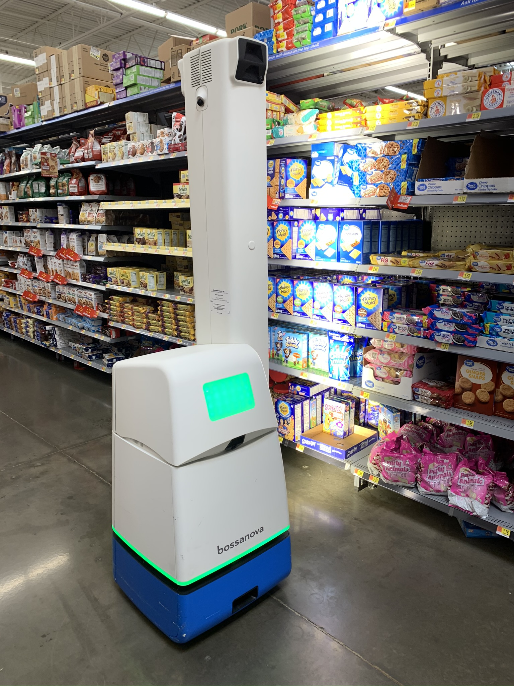

<<<<<<< HEAD
# Retail {.unnumbered}
=======
# Retail
>>>>>>> 926f2417470d27ddf9990340329d18b8345e1cf8

## Introduction

AI can be used in many facets of the retail industry such as providing personalized recommended products, managing inventory, and creating customer service chatbots (Sularia, 2023). According to a KPMG study, the three areas that retail companies thought AI would have the biggest impact in the retail industry are “customer intelligence …, inventory management … and chatbots for customer service” (KPMG).

Walmart has been implementing AI in many areas of the company. Here are some examples of how Walmart is using AI:

## Retail Stores

### In-Store Robots

Walmart uses AI in its stores through the use of a robotic floor cleaner which also takes photos of the shelves inside the store (DeVon, 2023). Based on these images, a program automatically alerts the store of what product needs to be restocked (DeVon, 2023). This two-in-one robot is useful in providing customers with a better shopping experience since it both cleans the floors and alerts of a needed restock so that customers are in a cleaner store with stocked shelves.

<<<<<<< HEAD
=======

>>>>>>> 926f2417470d27ddf9990340329d18b8345e1cf8
### Store that Relies on AI

Walmart launched a store that relies on AI in 2019 which contains many cameras to check the shelf inventory and sensors that get 1.6 TB of data every second (Perez, 2019). This store is known as the Walmart Intelligent Retail Lab (Future Stores). Employees are notified of specific items that need a restock based on this data (Perez, 2019). Walmart has plans to use AI to check to make sure shopping carts are available and that there are enough open check-out lines (Perez, 2019). However, there is a concern about jobs security with the use of AI, but Walmart says that “the tech isn’t replacing jobs, but instead frees up staff to interact with customers” (Perez, 2019). This could increase staff efficiency by having an AI find specific tasks that are needed to be fulfilled rather than having staff spend time looking for what needs to be done in a store. This time can then be spent on doing those needed tasks. Based on this store, “its best findings and developments will be applied and pared down across Walmart's 4,800 existing stores” (Future Stores). This shows that Walmart is testing out how AI can be useful in store. By utilizing a test store, they don’t have to spend additional resources on widespread adoption of potential features of AI that they later find to not be needed.

<<<<<<< HEAD
=======

>>>>>>> 926f2417470d27ddf9990340329d18b8345e1cf8
## Online

### Substitutable Product Algorithm

Walmart uses AI to determine a substitute item for a customer’s online grocery order (Owen, 2021). This recommended substitute is sent to a customer where it is approved or denied (Owen, 2021). The data of this decision is reported and is used to help train the AI (Owen, 2021). After implementing the AI-powered substitution algorithm, Walmart says that there is now around a 97% acceptance rate for substitutes up from 90% (Silberling, 2021). By having an increase in acceptance rate of substitutes, Walmart is able to get more sales since a customer is more willing to buy a similar item rather than no longer buying an item. It also provides a customer with potentially more similar items through this algorithm, so they have a better substitute than what would have been previously offered.

<<<<<<< HEAD
=======

>>>>>>> 926f2417470d27ddf9990340329d18b8345e1cf8
### Virtual Model Clothing Try-On

According to “David Sobie, co-founder and CEO of Happy Returns” as much as 40% of products bought online get returned (Owen, 2021). This could be from not being able to see the item in person, and in the case of clothes, you are not able to try it on when you buy it online. Walmart announced in 2021 that they would be acquiring Zeekit which allows you to try on clothes virtually (Owen, 2021). After Walmart acquired Zeekit, they created a new feature called “Choose My Model” that is used for women’s clothes which has 50 models with different body types, heights, and skin tones that a customer chooses from (Perez, 2022). This uses “neural networks, which analyze catalog images of garments to create a dressed image … [from] a diverse set of Walmart model images” which helps a customer better see how a clothing item may look on them (Perez, 2022). This has the potential to reduce the amount of Walmart clothing returns if customers are able to see a clothing item on a model that resembles themselves.

<<<<<<< HEAD
## Conclusion

Through taking a look at some of the areas that Walmart is implementing AI, we can see that AI can be used in many applications of retail, even just within one company. Walmart is investing into the development of AI through expanding the number of data scientists they employ (Goldman, 2022). “Srini Venkatesan EVP, U.S. Omni Tech at Walmart Global Tech” says that AI at Walmart is “a constant evolution” that focuses on improving the customer experience (Goldman, 2022). Retailers are implementing AI to improve the customer experience and staff efficiency to increase profits.

(Sularia, 2023) https://www.forbes.com/sites/forbestechcouncil/2023/03/14/six-ways-retail-can-leverage-generative-ai-to-transform-business/?sh=650ac8774b7e

(KPMG) https://info.kpmg.us/news-perspectives/technology-innovation/thriving-in-an-ai-world/ai-adoption-retail.html
=======

## Conclusion

Through taking a look at some of the areas that Walmart is implementing AI, we can see that AI can be used in many applications of retail, even just within one company. Walmart is investing into the development of AI through expanding the number of data scientists they employ (Goldman, 2022). Beyond just implementing AI at Walmart, “Srini Venkatesan EVP, U.S. Omni Tech at Walmart Global Tech” says that AI at Walmart is “a constant evolution” that focuses on improving the customer experience (Goldman, 2022). From the examples of AI adoption in Walmart, implementing AI in a retail company is for improving the customer experience and increasing staff efficiency to increase profits.

[Sularia, 2023] https://www.forbes.com/sites/forbestechcouncil/2023/03/14/six-ways-retail-can-leverage-generative-ai-to-transform-business/?sh=650ac8774b7e

[KPMG] https://info.kpmg.us/news-perspectives/technology-innovation/thriving-in-an-ai-world/ai-adoption-retail.html
>>>>>>> 926f2417470d27ddf9990340329d18b8345e1cf8

(DeVon, 2023) https://www.cnbc.com/2023/05/19/from-amazon-to-walmart-how-companies-plan-to-incorporate-ai.html

(Silberling, 2021) https://techcrunch.com/2021/06/24/walmarts-ai-is-getting-smarter-about-grocery-delivery/

(Owen, 2021) https://emerj.com/ai-sector-overviews/ai-at-walmart/

(Perez, 2022) https://techcrunch.com/2022/03/02/walmart-launches-a-i-powered-virtual-clothing-try-on-technology-for-online-shoppers/

(Perez, 2019) https://techcrunch.com/2019/04/25/walmart-unveils-an-a-i-powered-store-of-the-future-now-open-to-the-public/

(Future Stores)
https://futurestoreseast.wbresearch.com/blog/walmart-ai-powered-store-strategy-future-amazon-go

(Goldman, 2022) https://venturebeat.com/ai/ai-is-embedded-everywhere-at-walmart/